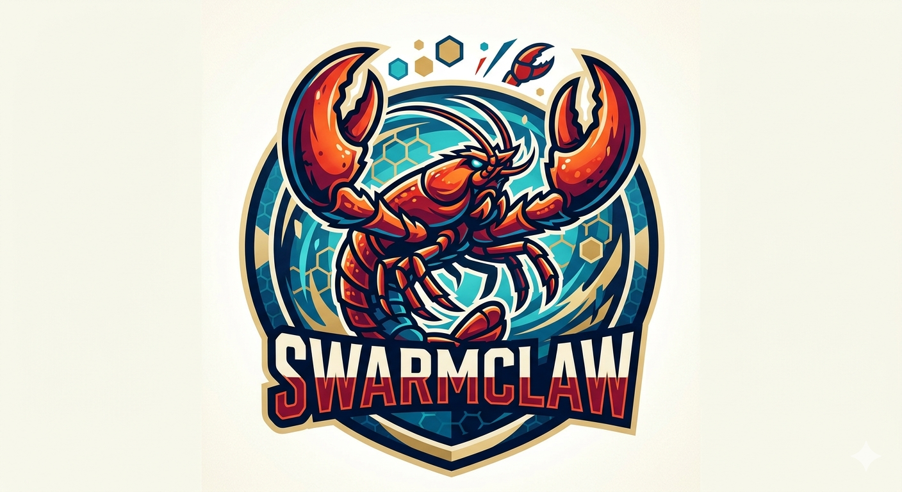

# swarmclaw: Pocket AI Assistant on a $5 Chip

<p align="center">
  <picture>
    <source media="(prefers-color-scheme: dark)" srcset="assets/swarmclaw_dark.png">
    
  </picture>
</p>

<p align="center">
  <a href="LICENSE"></a>
</p>

**A branch of existing project [mimiclaw](https://github.com/memovai/mimiclaw)**

**The world's first AI assistant(OpenClaw) on a $5 chip. No Linux. No Node.js. Just pure C**

Swarmclaw turns a tiny ESP32-S3 board into a personal AI assistant. Plug it into USB power, connect to WiFi, and talk to it through your favorite messaging app — it handles any task you throw at it and evolves over time with local memory — all on a chip the size of a thumb.

## Meet Swarmclaw

- **Tiny** — No Linux, no Node.js, no bloat — just pure C
- **Handy** — Message it from Telegram or Feishu, it handles the rest
- **Loyal** — Learns from memory, remembers across reboots
- **Energetic** — USB power, 0.5 W, runs 24/7
- **Lovable** — One ESP32-S3 board, $5, nothing else

## Quick Start

```bash
# You need ESP-IDF v5.5+ installed first:
# https://docs.espressif.com/projects/esp-idf/en/v5.5.2/esp32s3/get-started/

git clone https://github.com/memovai/mimiclaw.git
cd mimiclaw

idf.py set-target esp32s3
```

Then build and flash:

```bash
# Clean build (required after any mimi_secrets.h change)
idf.py fullclean && idf.py build

# Find your serial port
ls /dev/cu.usb*          # macOS
ls /dev/ttyACM*          # Linux

# Flash and monitor (replace PORT with your port)
# USB adapter: likely /dev/cu.usbmodem11401 (macOS) or /dev/ttyACM0 (Linux)
idf.py -p PORT flash monitor
```

## Onboarding Web Portal

After first boot (or when onboarding mode is enabled), Swarmclaw exposes a local setup portal:

- AP SSID: `Swarmclaw-XXXX`
- URL: `http://192.168.4.1`
- Main actions: scan WiFi, configure LLM/provider keys, toggle features, and save + restart

## Supported Channels

| Channel | Description | Features |
|---------|-------------|----------|
| **Telegram** | Native Telegram bot interface | Full command support, file attachments, inline queries |
| **Feishu** | Feishu/Lark robot integration | Enterprise messaging, group chat support |

## Tools

| Tool | Usage | 
|----------|-------|
| **Cron** | run task at given unix timestamp or at given interval | 
| **File** | add, remove, edit and list files | 
| **A2A Client** | call A2A server; supports `send/get/cancel/agent_card` |
| **Device Control** | immediate WS2812 RGB control on GPIO48 (`set/off/status`) |
| **HTTP Request** | execute `http` request to access API | 
| **Script** | write and run `lua` script in real time | 
| **Web Search** | Search anything on the Internet | 
| **camera capture** | Capture images from the onboard camera | 
| **bthome listener** | Listen for BTHome device updates | 
 
## Supported LLM Providers

| Provider | Value | API Endpoint | Notes |
|----------|-------|-------------|-------|
| Anthropic (Claude) | `anthropic` | api.anthropic.com | Default |
| OpenAI (GPT) | `openai` | api.openai.com | |
| OpenRouter | `openrouter` | openrouter.ai | Free tier available |
| NVIDIA NIM | `nvidia` | integrate.api.nvidia.com | Free tier available |
| Alibaba Cloud Qwen | `qwen` | dashscope.aliyun.com | |

## Supported Web Search Providers

| Provider | Value | API Endpoint | Notes |
|----------|-------|-------------|-------|
| tavily | `tavily` | api.tavily.com | Default |
| brave | `brave` | api.search.brave.com | |

## Hardware Requirements

- ESP32 development board with PSRAM
- WS2812 RGB LED (default GPIO 48)


## License

MIT License - see [LICENSE](LICENSE) file for details.

## Links

- [mimiclaw](https://github.com/memovai/mimiclaw) - Main project
- Author: Junchi Wang
